# Documenting From PRs

## Overview

Turn GitHub pull requests into accurate, well-structured documentation by systematically extracting details, determining impact, reading existing conventions and verifying output.

## When to Use

```
User gives PRs → Documenting-From-PRs → Write docs
```

- Given a list of PR URLs, numbers, or descriptions and asked to document them
- Given a changelog or release notes and asked to write docs
- Given feature descriptions and asked to create documentation pages
- Asked to "update the docs for release X"

**Do NOT use for:**

- Writing docs from scratch with no source material (use brainstorming first)
- Fixing typos or formatting only
- Purely structural reorgs with no new content

## Core Workflow

### Phase 1: Fetch & Extract

Fetch each PR with `gh pr view`:

```bash
gh pr view <number> --json title,body,additions,deletions,files
```

**Extract structured details into a table:**

| Element            | Source             | Example                                     |
| ------------------ | ------------------ | ------------------------------------------- |
| New endpoints      | PR body, code diff | `POST /players/{id}/inventory`              |
| New SDK methods    | PR body, code diff | `PlayerInventory.AddItem(itemId, quantity)` |
| Changed config     | PR body, code diff | New field `maxInventorySlots`               |
| Breaking changes   | PR description     | Old endpoint removed                        |
| New dependencies   | Package files      | New Steamworks v2 package                   |
| Affected platforms | Files changed      | Unity, Godot, HTTP API                      |

**Do not skip PRs.** If you cannot access a PR (private repo, doesn't exist, network error), stop and ask the user for the details. Do not guess or use only the PR title.

### Phase 2: Determine Documentation Impact

For each extracted detail, classify the impact:

```dot
digraph impact {
    "New endpoint or API?" [shape=diamond];
    "New SDK feature?" [shape=diamond];
    "Config/settings change?" [shape=diamond];
    "Integration update?" [shape=diamond];
    "Behavior change?" [shape=diamond];

    "New HTTP API page (.mdx)" [shape=box];
    "Update existing HTTP page" [shape=box];
    "New feature page in each platform" [shape=box];
    "Update settings-reference for each platform" [shape=box];
    "Update install page if new capability" [shape=box];
    "Update/rewrite integration page" [shape=box];
    "Add cross-reference to affected features" [shape=box];
    "Update type definitions in HTTP page" [shape=box];

    "New endpoint or API?" -> "New HTTP API page (.mdx)" [label="yes, new service"];
    "New endpoint or API?" -> "Update existing HTTP page" [label="yes, existing service"];
    "New SDK feature?" -> "New feature page in each platform" [label="yes"];
    "New SDK feature?" -> "Update settings-reference for each platform" [label="also check"];
    "Config/settings change?" -> "Update settings-reference for each platform" [label="yes"];
    "Config/settings change?" -> "Update install page if new capability" [label="check"];
    "Integration update?" -> "Update/rewrite integration page" [label="yes"];
    "Behavior change?" -> "Add cross-reference to affected features" [label="yes"];
    "Behavior change?" -> "Update type definitions in HTTP page" [label="if new fields"];
}
```



**Critical rule:** If this repo has mirrored platform docs (e.g., Unity and Godot), document all platforms. A PR that adds a Unity method nearly always needs a corresponding Godot page. Check the repo structure: if `docs/unity/` and `docs/godot/` have matching files, mirror your changes. Exception: if the feature is genuinely platform-specific (e.g., Steamworks session tickets in Unity vs web API tickets in Godot), document only the relevant platform and note why the other doesn't apply.

**Route type rule:** The backend has three route types: `public` (unauthenticated), `protected` (admin/dashboard authentication), and `api` (API key authentication). Only `api` routes belong in the HTTP API reference documentation. `protected` routes are for the dashboard/admin UI and should never be documented in `docs/http/`. If a feature includes protected routes, mention the dashboard as the management interface instead.

### Phase 3: Read Conventions

**Before writing a single line**, read:

1. 2-3 similar existing pages for tone, structure, and frontmatter patterns
2. The pages you'll need to cross-reference
3. The sidebar config (`sidebars.ts`) and `_category_.json` files for positioning

### Phase 4: Write Documentation

**File format decision:**

- `.md` for: install/getting-started, reference pages, overviews, integrations
- `.mdx` for: feature pages with code samples + React components, HTTP API pages using `ServiceDocumentation`

**Frontmatter (always verify against existing pages):**

```yaml
---
sidebar_position: <next-available>
description: <SEO description>
---
```

For HTTP API `.mdx` pages using `ServiceDocumentation`:

```mdx
import { ServiceDocumentation } from '@site/src/components/documentation/ServiceDocumentation'
import { generateServiceTOC } from '@site/src/components/documentation/generateServiceTOC'

export const service = 'ExactBackendServiceName'
export const toc = [
  { value: 'Endpoints', id: 'endpoints', level: 2 },
  ...generateServiceTOC(service),
]
```

**Platform-specific terminology** — use each platform's native vocabulary, never cross-contaminate:

| Concept         | Unity (C#)                             | Godot (GDScript)                             |
| --------------- | -------------------------------------- | -------------------------------------------- |
| Event system    | "events", "firing", "subscribing"      | "signals", "emitting", "connecting"          |
| Method style    | PascalCase `AddEntry()`                | snake_case `add_entry()`                     |
| Error handling  | exceptions, `try/catch`                | error signals, return codes                  |
| Data structures | `Dictionary<K,V>`, `KeyValuePair<K,V>` | `Dictionary` (variant-based), `{ "key": v }` |
| Logging         | `Debug.Log()`                          | `print()` or `push_warning()`                |
| Async           | `async/await` / `Task<T>`              | `await` with coroutines                      |
| Properties      | C# properties `{ get; set; }`          | `setget` or direct member access             |

**Cross-references** using absolute paths from `/docs/`:

```markdown
[text](/docs/section/page#anchor)
```

**Platform isolation rule:** API docs and SDK docs serve entirely different audiences. A developer using the HTTP API directly is building their own client and does not care about the Unity package or Godot plugin. A developer using the Unity package or Godot plugin expects the docs to explain how the SDK works, not to send them to raw API reference pages.

Because of this, you must treat the doc sets as completely separate:

- **In HTTP API docs:** Do not mention SDKs, wrappers, or helper libraries. Do not link to Unity/Godot pages. Do not tell API users that "the SDK handles this for you." API docs describe the protocol, endpoints, headers, and server behavior only.
- **In SDK docs (Unity/Godot):** Do not link to HTTP API reference pages. Do not tell SDK users to "see the API docs for more details." SDK docs describe the settings, methods, and automatic behaviors of the package. If the SDK abstracts an API concept, explain the SDK abstraction in SDK terms. Do not punt the reader to protocol-level documentation.
- **In socket docs:** Same rule applies. Socket reference docs explain the wire format and error codes. SDK socket pages explain how to send/receive in the SDK.

Cross-references should only happen within the same platform family: API ↔ API, Unity ↔ Unity, Godot ↔ Godot. The only exception is when a dashboard/admin concept genuinely spans all platforms (e.g., explaining how a game setting affects every client). Even then, keep the reference brief and do not send the reader away from their current platform's docs.

### Phase 5: Verify

```bash
npm run build
```

Fix any build errors. Check that:

- No broken links
- All sidebar_positions are unique within their directory
- All `_category_.json` positions are correct
- New pages appear in the expected sidebar location

## Quick Reference

| Task                            | Approach                                                                        |
| ------------------------------- | ------------------------------------------------------------------------------- |
| Find next sidebar_position      | Read the directory, find highest number, add 1                                  |
| Choose .md vs .mdx              | `.mdx` only if using React components (`ScopeBadges`, `ServiceDocumentation`)   |
| Determine if new page or update | New endpoint/service = new page. New method on existing class = update existing |
| Code sample language            | Match existing: `csharp` for Unity, `gdscript` for Godot                        |
| When to add `:::tip` callout    | Only if there's a relevant blog post or external resource                       |
| HTTP API ServiceDocumentation   | Only if backend `/public/docs` already serves that service                      |
| Cross-reference when updating   | Always add links FROM related pages TO new content                              |

## Common Mistakes

| Mistake                                                                     | Fix                                                                          |
| --------------------------------------------------------------------------- | ---------------------------------------------------------------------------- |
| Documenting only one platform (e.g., Unity) when both Unity and Godot exist | Mirror: create matching Godot page with GDScript examples                    |
| Not running `npm run build` to verify                                       | Always build after writing                                                   |
| Writing GDScript in `csharp` blocks or vice versa                           | Copy language identifier from existing pages                                 |
| Not updating `_category_.json` when adding a new section                    | Check if new directory needs a category file                                 |
| Creating .mdx for simple reference content that doesn't need React          | Use `.md`                                                                    |
| Not linking back from related pages                                         | Update at least the parent/category page to mention the new feature          |
| Using Unity terminology in Godot docs ("fires an event")                    | Godot uses "emits a signal"; check existing Godot pages for phrasing         |
| Using Godot terminology in Unity docs ("connects to a signal")              | Unity uses "subscribes to an event"; check existing Unity pages for phrasing |

## Red Flags - STOP and Check

- "This is simple, just one endpoint" → Still follow the full workflow
- "I'll guess the sidebar_position, it's probably fine" → Read the directory
- "No need to build, it's just markdown" → Build catches broken links and frontmatter issues
- "The PR description has everything I need" → PRs often omit context; check the diff too
- "The PR is inaccessible, I'll just use the title" → Ask the user for details, never guess
- "Events and signals are the same thing" → Use each platform's native vocabulary; mixing them reads as sloppy
